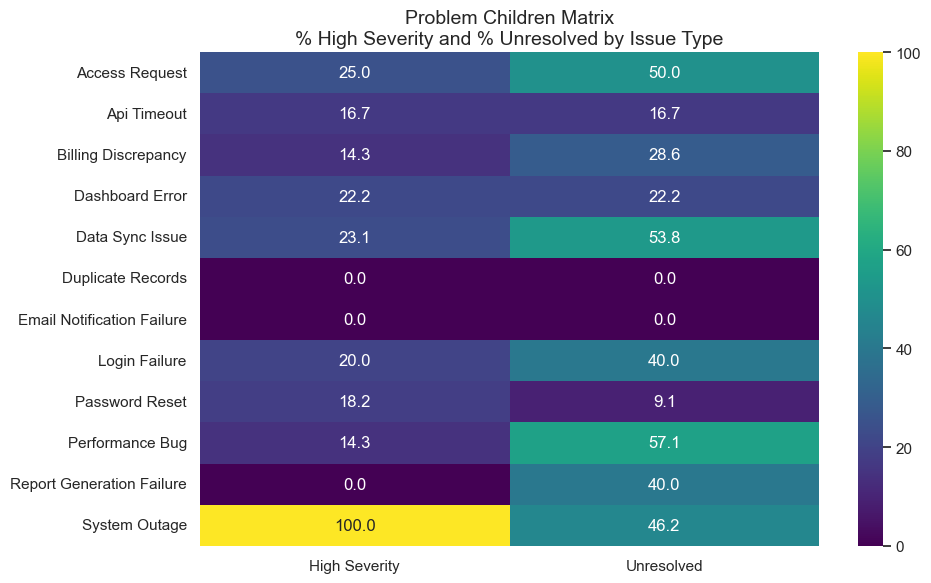
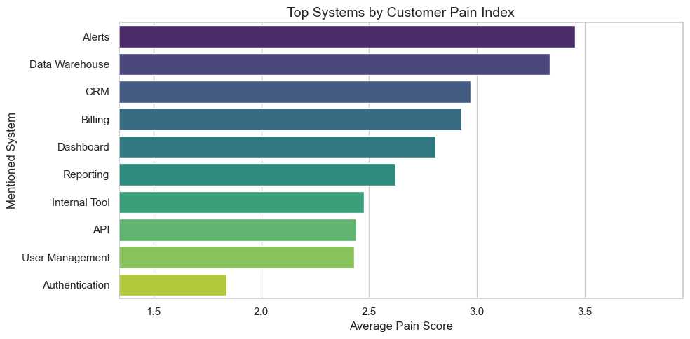
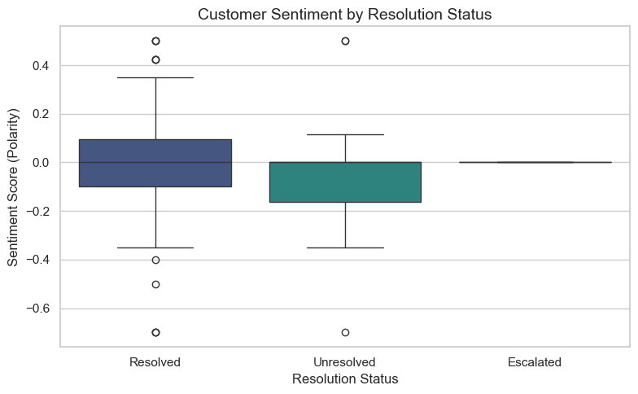
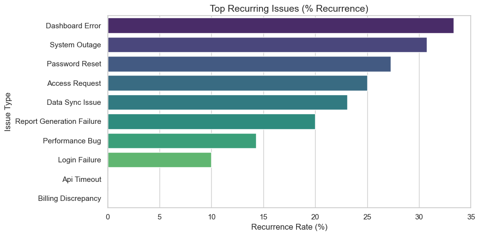

# Unstructured Support Notes to Operational KPIs Pipeline
Automatically converts unstructured, freeform customer support notes into operational KPIs by extracting issue signals, scoring customer pain, identifying escalation risk, and enabling prioritization.

#### ‼️ Use Jupyter Notebook - Not Google Colab

# Freeform Support Notes Extraction & Analysis

## Objective

This Jupyter Notebook enables Support Operations teams to proactively identify operational bottlenecks, reduce escalations, and improve customer satisfaction by transforming buried freeform notes into structured KPIs.

It transforms raw support notes into analyzable fields like issue type, severity, escalation status, and follow-up needs — enabling data-driven decision-making across support operations.

---

## Dependencies
- `pandas`
- `numpy`
- `openai`
- `matplotlib`, `seaborn`
- `textblob`
- `python-dotenv`
- `tqdm`
- `nltk`
- `openpyxl`

---

##  Workflow Summary

### 1. Load & Clean Data
It imports the support notes from CSV, normalize column names, and validate structure. All downstream logic assumes a standardized 'support_note' field as the input for LLM processing.

### 2. LLM Extraction
It uses OpenAI’s `gpt-4o-mini` to extract structured insights from each support note. The system prompt ensures consistent fields: issue type, mentioned systems, severity level, resolution status, escalation flag, and follow-up flag. The output is parsed as strict JSON for error-free tabulation.

### 3. Sentiment Analysis
Using TextBlob, it extracts polarity scores from each note to gauge emotional tone. This adds interpretability to unresolved or escalated cases and is incorporated into the pain score.

### 4. Validation
Each row is flagged for extraction validity. Sanity checks ensure field distributions are reasonable, and system references are standardized for consistency in grouping.

### 5. Export
Final structured data is saved to `.csv` and `.xlsx` formats for use in dashboards or external BI tools. All processing is modular and reproducible.

---

## Visualizations

### Includes business-ready charts for:

- **Problem Children Matrix**  
  Heatmap of the % of High Severity and % Unresolved cases by issue type. This reveals which issue categories need operational focus.



Heatmap of the % of High Severity and % Unresolved cases by issue type. This reveals which issue categories need operational focus.

---

- **Customer Pain Index**  
  Aggregated score across severity, resolution, escalation, follow-up, and sentiment. Systems with highest average pain score are prioritized for engineering or UX review.



This chart shows aggregated scores across severity, escalation, and follow-up flags for support tickets.

---

- **Sentiment by Resolution Status**  
  Boxplot showing how sentiment correlates with resolution outcomes. Helps understand emotional impact of unresolved or escalated tickets.



Boxplot showing how sentiment correlates with resolution outcomes. Helps understand emotional impact of unresolved or escalated tickets.

---

- **Recurring Problem Rate**  
  Bar chart showing frequency of recurrence-related keywords per issue type. Useful for identifying areas needing systemic fixes or knowledge base improvements.



Bar chart showing frequency of recurrence-related keywords per issue type. Useful for identifying areas needing systemic fixes or knowledge base improvements.

---

## Notes

- **Model upgrade**: Used `gpt-4o-mini` to improve severity inference (which was weak in `gpt-3.5-turbo`). The rate of LLM extraction validation (effectively the rate of success of the LLM) was only 83.33% with `gpt-3.5-turbo` and was 100% with `gpt-4o-mini`. That said, the tokens are more expensive, so that will need to be taken into consideration for an actual business.
- **Total token usage** printed at the end for transparency.
- The system is modular and scalable for future extensions (e.g., fallback rules, QA, human-in-the-loop).

## Folder Structure
```
Freeform-Support-Notes-to-Operational-KPIs/
├── README.md
├── Support-Notes-into-Structured-Dataset.ipynb
├── support_notes.csv
├── Assets/
│   ├── support_memo.pdf # A memo from the Director of Support Operations outlining the challenge of extracting actionable insights from freeform support notes, which this project solves.
│   ├── 1.png  # problem_children_matrix
│   ├── 2.png  # customer_pain_index
│   ├── 3.png  # sentiment_by_resolution
│   └── 4.png  # recurring_problem_rate
```
